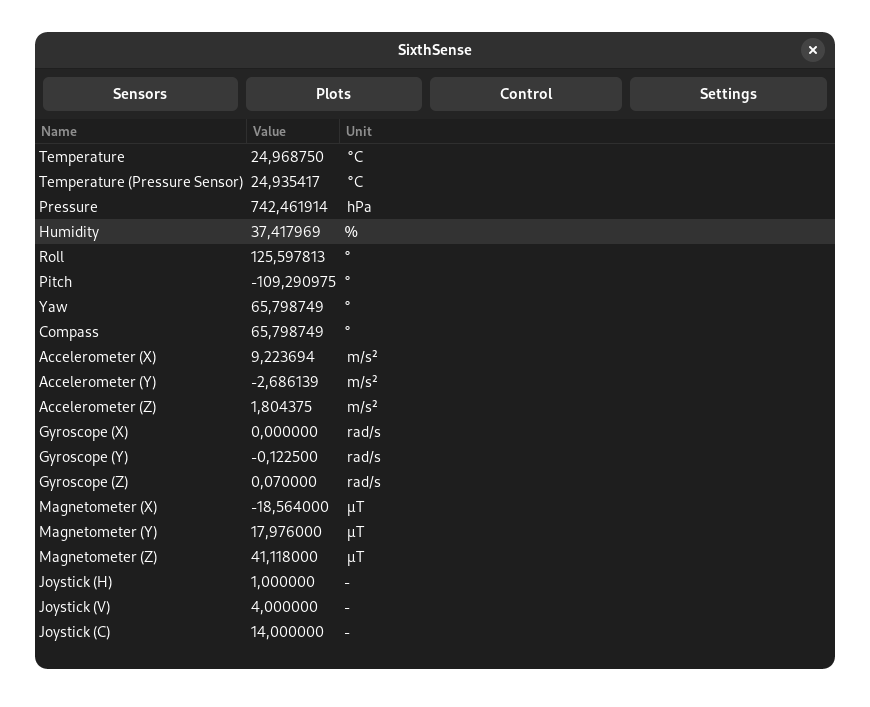
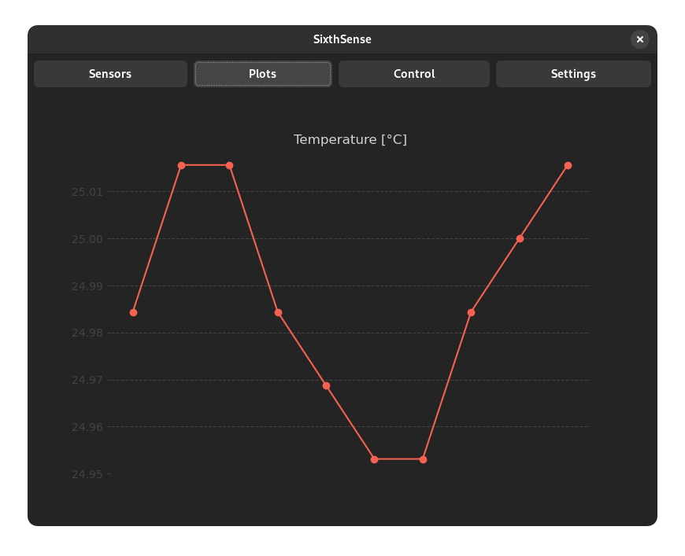
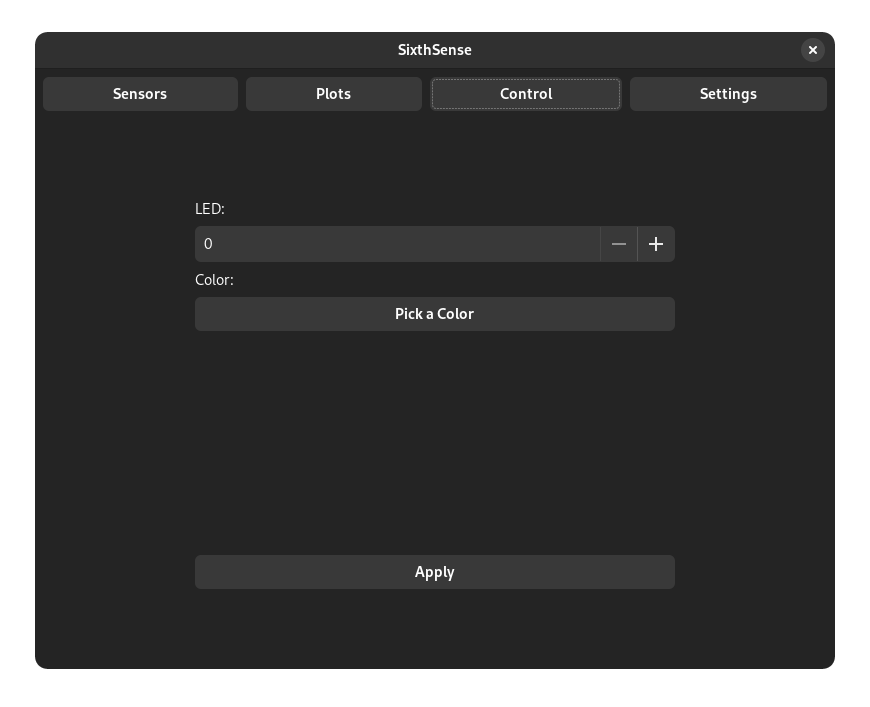
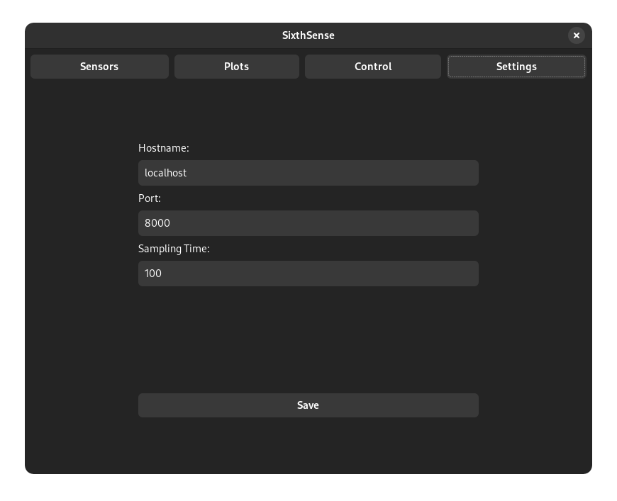

<h1 align="center">
  
   SixthSense  
</h1>

  <a href="https://github.com/ikajdan/sixthsense_server">Web Client</a> •
  <a href="https://github.com/ikajdan/sixthsense_mobile">Mobile Client</a> •
  <a href="https://github.com/ikajdan/sixthsense_desktop">Desktop Client</a>

The aim of this project was to create an IoT (Internet of Things) system composed of a SBC (Single Board Computer) with a Sense HAT attached. The server should host a REST (Representational State Transfer) API (Application Programming Interface) that enables clients to read and control peripherals of the hat.

Data from various sensors on the Sense HAT should be collected and exposed through the REST API. Real-time plots of the sensor data should be displayed on each client. The user should be able to control the LED matrix on the Sense HAT.

All the clients should expose a GUI (Graphical User Interface) to the user allowing for interaction with the embedded system. Three REST clients were developed:
- [web-based client](https://github.com/ikajdan/sixthsense_server),
- [Android mobile client](https://github.com/ikajdan/sixthsense_mobile),
-  Linux desktop client (this repository).

## Desktop Client

The desktop client is written in Python and the GTK3 toolkit. Each view is contained within a class inherited from the `Gtk.Box`. The client uses the `requests` library to communicate with the server. The data for the `Gtk.TreeView` is kept in the `list_store` member. The sensors table is generated dynamically.

 

  
&nbsp; &nbsp; &nbsp; &nbsp;
  
    
  <em>Sensors (left) and plots (right) pages.</em>

 

 

  
&nbsp; &nbsp; &nbsp; &nbsp;
  
    
  <em>LED control (left) and settings (right) pages.</em>

 

## License

This project is licensed under the MIT License. See the [LICENSE](LICENSE.md) file for details.
